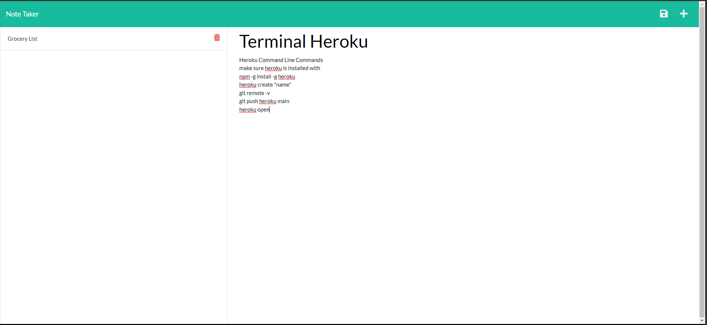

# Note-Taker
  ## Table of Contents
  - [Description](#Description)
  - [Installations](#Installations)
  - [Usage](#Usage)
  - [Technologies](#Technologies)
  - [Preview](#Preview)
  - [Contributors](#Contributors)
  - [License](#License)
  ## Description
  Allows users to create notes that will be saved in local storage so they will reload when revisiting the page.
  
  ## Installations
  Use VsCode and gitbash. Use NPM init to create a package.json and npm i to install express and uuid when they are in the dependencies

  ## Usage
  Users can create a title and note body, save them and they will persist upon closing the app.

  ## Technologies
  node, express, uuid, html, javascript

  ## Preview
  

  ## Contributors
  Anthony Jimenez

  ## License
  This application uses No license. 
   
